# Despliegue de PokeDex en Azure Static Web Apps

Este documento describe, paso a paso, el proceso completo que se realizó para desplegar la aplicación **PokeDex** (Angular 14) en **Azure Static Web Apps** con integración continua (CI/CD) a través de **GitHub Actions**.

---

## 1. Información general del despliegue

- **Tipo de recurso en Azure:** Static Web App (Aplicación web estática)
- **Nombre del recurso:** `produccion-PokeDex`
- **Grupo de recursos:** `produccion`
- **Suscripción:** Azure subscription 1 (`2f2ee97a-3297-4722-b64f-e110b07dac99`)
- **Región (Functions / staging):** `East US 2`
- **Plan (SKU):** `Free`
- **Origen del código:** GitHub — `https://github.com/Jhojam1/PokeDex`
- **Rama desplegada:** `main`
- **Framework detectado:** Angular
- **App location:** `/`
- **API location:** *(vacío — la app no expone API)*
- **Output location:** `dist/pokedex-angular`
- **Política de autorización:** Deployment token
- **URL pública resultante:** `https://delightful-pond-04c554d0f.1.azurestaticapps.net`

---

## 2. Requisitos previos

Antes de iniciar el despliegue se validaron los siguientes requisitos:

- **Cuenta de Azure** activa con permisos para crear recursos.
- **Cuenta de GitHub** Con acceso de escritura al repositorio.
- Repositorio con el código fuente del proyecto Angular y el script de build configurado en `package.json`:
  - `"build": "ng build"` genera la salida en `dist/pokedex-angular` según `angular.json`.
- Node.js y Angular CLI instalados localmente para pruebas previas (`npm install`, `npm run build`).

---

## 3. Acceso al portal de Azure

Se ingresó al portal `https://portal.azure.com` con la cuenta institucional. Desde el panel principal de **Servicios de Azure** se ubicó el ícono **Static Web Apps** para iniciar la creación del recurso.

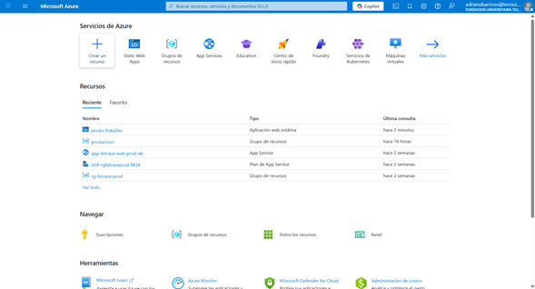

---

## 4. Creación del recurso Static Web App

### 4.1. Pestaña *Basics*

En el formulario **Create Static Web App** se configuraron los siguientes campos:

- **Subscription:** `Azure subscription 1`
- **Resource Group:** `produccion` (creado nuevo con la opción *Create new*)
- **Name:** `produccion-PokeDex`
- **Hosting plan → Plan type:** `Free: For hobby or personal projects`
- **Region:** `Global` (las Static Web Apps distribuyen el contenido globalmente por CDN)
- **Source (Deployment details):** `GitHub`

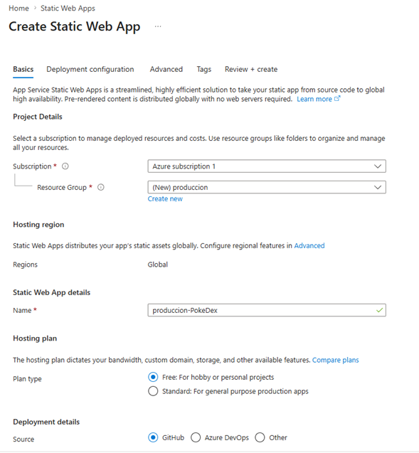

### 4.2. Autorización de GitHub

Al seleccionar **GitHub** como origen, Azure solicitó permisos para leer repositorios y crear el workflow de GitHub Actions. Se autorizó la aplicación **Azure App Service Creates** concediendo acceso a repositorios públicos y privados y la capacidad de actualizar archivos de workflow.

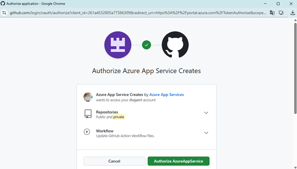

Una vez autorizada la cuenta, el portal mostró la cuenta vinculada `Jhojam1` y habilitó los selectores de **Organization**, **Repository** y **Branch**.

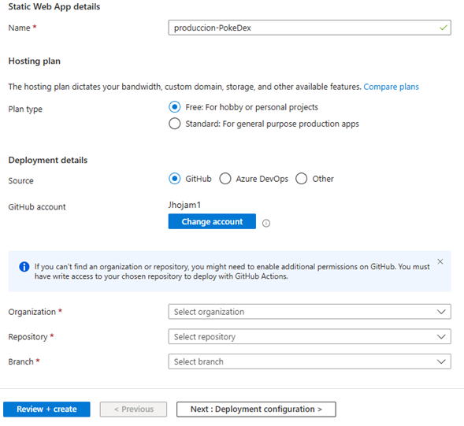

### 4.3. Detalles del build

Se seleccionó el repositorio y la configuración de build:

- **Organization:** `Jhojam1`
- **Repository:** `PokeDex`
- **Branch:** `main`
- **Build Presets:** `Angular (detected)` — Azure detecta automáticamente el framework.
- **App location:** `/`
- **Api location:** *(vacío)*
- **Output location:** `dist/pokedex-angular`

Estos valores se utilizan para generar el archivo de workflow de GitHub Actions.

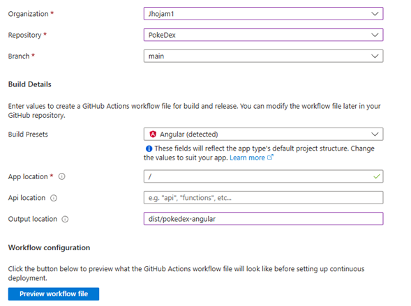

### 4.4. Pestaña *Deployment configuration*

- **Deployment authorization policy:** `Deployment token`

Esta opción hace que Azure genere un token secreto que se inyecta automáticamente en el repositorio de GitHub como *secret* (`AZURE_STATIC_WEB_APPS_API_TOKEN_DELIGHTFUL_POND_04C554D0F`). El workflow lo utilizará para subir los artefactos.

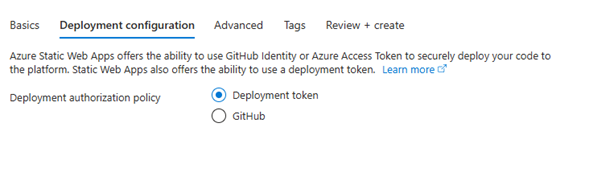

### 4.5. Pestaña *Advanced*

- **Region for Azure Functions API and staging environments:** `East US 2`
- **Enterprise-grade edge:** *deshabilitado* (requiere plan Standard).

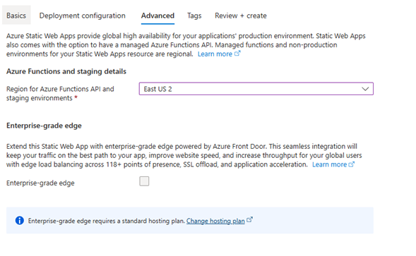

### 4.6. Pestaña *Review + create*

Se validó el resumen completo y se presionó **Create**:

- **Subscription:** `2f2ee97a-3297-4722-b64f-e110b07dac99`
- **Resource Group:** `produccion`
- **Name:** `produccion-PokeDex`
- **Region:** `eastus2`
- **SKU:** `Free`
- **Repository:** `https://github.com/Jhojam1/PokeDex`
- **Branch:** `main`
- **App location:** `/`
- **Output location:** `dist/pokedex-angular`
- **Deployment authorization policy:** `Deployment token`

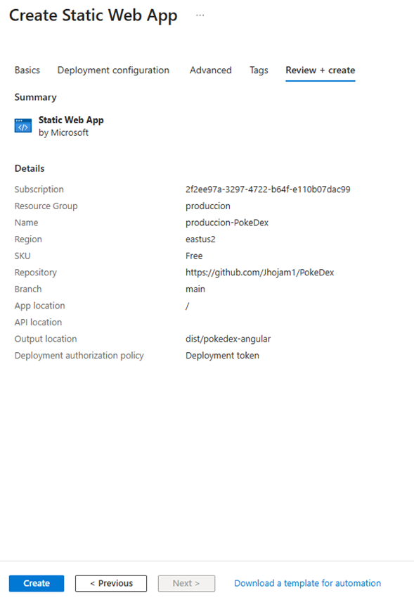

---

## 5. Recurso creado y visión general

Al finalizar la creación, Azure redirigió a la vista **Overview** del recurso `produccion-PokeDex`, mostrando:

- Grupo de recursos `produccion`, ubicación `Global`, SKU `Free`.
- URL pública: `https://delightful-pond-04c554d0f.1.azurestaticapps.net`.
- Source: `main` (GitHub).
- Enlace al **workflow** `azure-static-web-apps-delightful-pond-04c554d0f.yml` generado automáticamente en GitHub Actions.

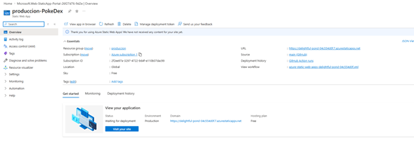

---

## 6. Integración continua con GitHub Actions

Azure creó y commiteó de forma automática el archivo de workflow en la rama `main` del repositorio:

- Ruta: `.github/workflows/azure-static-web-apps-delightful-pond-04c554d0f.yml`

Contenido utilizado para la publicación:

```yaml
name: Azure Static Web Apps CI/CD

on:
  push:
    branches:
      - main
  pull_request:
    types: [opened, synchronize, reopened, closed]
    branches:
      - main

jobs:
  build_and_deploy_job:
    if: github.event_name == 'push' || (github.event_name == 'pull_request' && github.event.action != 'closed')
    runs-on: ubuntu-latest
    name: Build and Deploy Job
    steps:
      - uses: actions/checkout@v3
        with:
          submodules: true
          lfs: false
      - name: Build And Deploy
        id: builddeploy
        uses: Azure/static-web-apps-deploy@v1
        with:
          azure_static_web_apps_api_token: ${{ secrets.AZURE_STATIC_WEB_APPS_API_TOKEN_DELIGHTFUL_POND_04C554D0F }}
          repo_token: ${{ secrets.GITHUB_TOKEN }}
          action: "upload"
          app_location: "/"
          api_location: ""
          output_location: "dist/pokedex-angular"

  close_pull_request_job:
    if: github.event_name == 'pull_request' && github.event.action == 'closed'
    runs-on: ubuntu-latest
    name: Close Pull Request Job
    steps:
      - name: Close Pull Request
        id: closepullrequest
        uses: Azure/static-web-apps-deploy@v1
        with:
          azure_static_web_apps_api_token: ${{ secrets.AZURE_STATIC_WEB_APPS_API_TOKEN_DELIGHTFUL_POND_04C554D0F }}
          action: "close"
```

### 6.1. Ejecución del workflow

Tras el primer commit del workflow, GitHub Actions ejecutó el pipeline **"ci: add Azure Static Web Apps workflow file"** con los siguientes jobs:

1. **Set up job**
2. **Build Azure/static-web-apps-deploy@v1**
3. **Run actions/checkout@v3**
4. **Build And Deploy**
5. **Post Run actions/checkout@v3**
6. **Complete job**

Todos los pasos finalizaron correctamente (estado verde). Desde la pestaña **Deployment history** del recurso se puede verificar el run y acceder al detalle en GitHub.

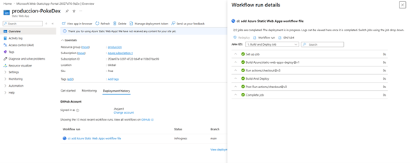

---

## 7. Configuración adicional del sitio (`staticwebapp.config.json`)

En la raíz del proyecto se encuentra el archivo `staticwebapp.config.json`. Azure Static Web Apps lo detecta de forma automática al servir el sitio y aplica las reglas definidas en él. Este archivo es **clave** para el despliegue porque resuelve dos problemas:

1. Que las imágenes y assets se sirvan correctamente aunque el build original estuviera pensado para GitHub Pages (`base-href=/pokedex-angular/`).
2. Reforzar la seguridad de la aplicación en producción con cabeceras HTTP.

Contenido del archivo:

```json
{
  "routes": [
    {
      "route": "/pokedex-angular/assets/*",
      "rewrite": "/assets/{wildcard}"
    }
  ],
  "globalHeaders": {
    "Content-Security-Policy": "default-src 'self'; script-src 'self'; style-src 'self' 'unsafe-inline' https://fonts.googleapis.com; font-src 'self' https://fonts.gstatic.com; img-src 'self' data: https: blob:; frame-ancestors 'none'; connect-src 'self' https://beta.pokeapi.co https://pokeapi.co https://*.pokeapi.co",
    "Strict-Transport-Security": "max-age=31536000; includeSubDomains; preload",
    "X-Content-Type-Options": "nosniff",
    "X-Frame-Options": "DENY",
    "Referrer-Policy": "no-referrer",
    "Permissions-Policy": "geolocation=(), microphone=(), camera=()"
  }
}
```

### 7.1. Sección `routes` — Rewrite de assets

```json
"routes": [
  {
    "route": "/pokedex-angular/assets/*",
    "rewrite": "/assets/{wildcard}"
  }
]
```

- **`route`**: patrón que Azure intercepta. Cualquier solicitud entrante cuya URL comience con `/pokedex-angular/assets/` será capturada por esta regla. El `*` actúa como comodín y se guarda en la variable `{wildcard}`.
- **`rewrite`**: URL interna real que Azure sirve. La petición se **reescribe** (no se redirige, la URL en el navegador no cambia) a `/assets/<lo-que-coincidió>`, que es donde realmente se publican los archivos dentro de `dist/pokedex-angular` tras el build de Angular.
- **¿Por qué se necesita?** El proyecto se construyó originalmente para publicarse en GitHub Pages bajo el sub‑path `/pokedex-angular/`. Algunas rutas del código y plantillas aún referencian `/pokedex-angular/assets/...`. En Azure Static Web Apps el sitio se sirve desde la raíz (`/`), por lo que sin esta regla esas solicitudes devolverían `404`. El rewrite permite que las URLs antiguas sigan funcionando sin tener que reescribir el código fuente.

### 7.2. Sección `globalHeaders` — Cabeceras de seguridad

Azure agrega cada una de estas cabeceras a **todas** las respuestas HTTP del sitio:

- **`Content-Security-Policy` (CSP)**: define qué orígenes pueden cargar recursos. Se listan explícitamente los dominios permitidos:
  - `default-src 'self'` → por defecto solo se permite contenido del propio dominio.
  - `script-src 'self'` → JavaScript solo desde el mismo origen (sin inline ni CDNs externos).
  - `style-src 'self' 'unsafe-inline' https://fonts.googleapis.com` → CSS propio, estilos inline (requerido por Angular) y Google Fonts.
  - `font-src 'self' https://fonts.gstatic.com` → fuentes propias y de Google Fonts.
  - `img-src 'self' data: https: blob:` → imágenes locales, base64, cualquier HTTPS y blobs (necesario porque los sprites de Pokémon se cargan desde dominios de GitHub/PokeAPI).
  - `frame-ancestors 'none'` → el sitio no puede ser embebido en iframes.
  - `connect-src 'self' https://beta.pokeapi.co https://pokeapi.co https://*.pokeapi.co` → las llamadas AJAX/GraphQL solo pueden ir a la propia app y a los endpoints de PokeAPI. Si se omite `pokeapi.co`, la CSP bloquearía las consultas y la PokeDex aparecería vacía.
- **`Strict-Transport-Security: max-age=31536000; includeSubDomains; preload`**: fuerza HTTPS durante un año, incluyendo subdominios.
- **`X-Content-Type-Options: nosniff`**: impide que el navegador deduzca el tipo MIME e interprete archivos como scripts por error.
- **`X-Frame-Options: DENY`**: refuerzo clásico (junto con `frame-ancestors`) para impedir clickjacking.
- **`Referrer-Policy: no-referrer`**: no envía la cabecera `Referer` al navegar fuera del sitio, protegiendo la privacidad.
- **`Permissions-Policy: geolocation=(), microphone=(), camera=()`**: deshabilita explícitamente APIs del navegador que la app no necesita.

> Nota: este archivo se copia tal cual desde la raíz al artefacto publicado (Azure lo busca tanto en la raíz del repo como dentro del `output_location`). No requiere pasos adicionales en el pipeline.

---

## 8. Ajuste en `environment.prod.ts` para que Azure encuentre las imágenes

El proyecto original estaba preparado para publicarse en **GitHub Pages** bajo la ruta `https://<usuario>.github.io/pokedex-angular/`. Por eso el `environment.prod.ts` tenía el `imagesPath` apuntando al sub‑path `/pokedex-angular/`:

```ts
// Versión original (GitHub Pages)
imagesPath: '/pokedex-angular/assets/images',
```

En **Azure Static Web Apps** el sitio se sirve desde la raíz del dominio (`https://delightful-pond-04c554d0f.1.azurestaticapps.net/`), por lo que esa ruta quedaba **rota**: el navegador pedía `/pokedex-angular/assets/images/...` y Azure respondía `404` porque ese prefijo no existe en el despliegue. En el sitio esto se traducía en que los sprites y la mayoría de íconos de Pokémon no aparecían.

La corrección fue apuntar el path a la raíz de los assets tal como los publica el build de Angular:

```ts
// @c:/Repositorio/Taller/PokeDex/src/environments/environment.prod.ts:1-12
export const environment = {
  production: true,
  pokeApi: 'https://pokeapi.co/api/v2',
  pokeApiGraphQL: 'https://beta.pokeapi.co/graphql/v1beta',
  homeAngular: 'https://angular.io/',
  homePokeApi: 'https://pokeapi.co/',
  keilerLinkedin: 'https://www.linkedin.com/in/keilermora/',
  pokedexGithub: 'https://github.com/keilermora/pokedex-angular',
  imagesPath: '/assets/images',
  language: 'en',
  languageId: 9,
};
```

**¿Por qué funciona con `/assets/images`?**

- El build `ng build` copia la carpeta `src/assets` a `dist/pokedex-angular/assets` (definido en `angular.json`).
- Azure publica el contenido de `dist/pokedex-angular` como raíz del sitio, por lo que la carpeta queda accesible en `https://.../assets/images/...`.
- Al comenzar con `/`, la ruta es **absoluta desde el dominio**, evitando problemas si el componente que la usa se navega desde rutas anidadas.

**Relación con `staticwebapp.config.json`:** el rewrite de la sección 7.1 atrapa las peticiones heredadas (`/pokedex-angular/assets/*`) que puedan quedar en plantillas/imports, mientras que este cambio en `environment.prod.ts` corrige las rutas que el código construye dinámicamente a partir de `environment.imagesPath`. Los dos ajustes juntos garantizan que **todas** las imágenes carguen correctamente en Azure.

---

## 9. Verificación del sitio publicado

Una vez completado el workflow se accedió a la URL generada por Azure:

- `https://delightful-pond-04c554d0f.1.azurestaticapps.net`

La aplicación **PokeDex** cargó correctamente mostrando los 151 Pokémon de primera generación y sus filtros por número, nombre y tipo.

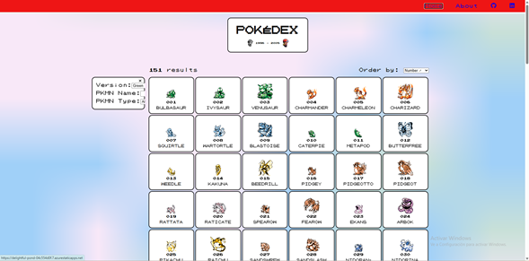

